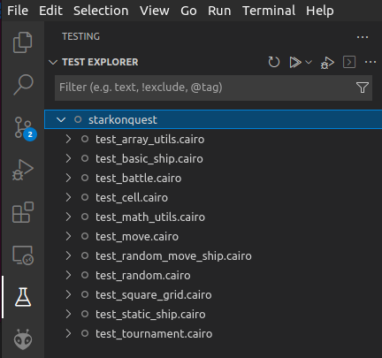

<p align="center">
    
</p>
<div align="center">
  <h1 align="center">Protostar Test Explorer</h1>
  <p align="center">
    <a href="https://discord.gg/onlydust">
        
    </a>
    <a href="https://twitter.com/intent/follow?screen_name=onlydust_xyz">
        
    </a>
    <a href="https://contributions.onlydust.xyz/">
        
    </a>
  </p>
  
  <h3 align="center">vscode extension to view protostar tests in the Test Explorer.</h3>
</div>

> ## ⚠️ WARNING! ⚠️
>
> This repo contains highly experimental code.
> Expect rapid iteration.

## 🎟️ Description

vscode extension to view protostar tests in the Test Explorer.

This extension uses vscode native TEst API

## 🎗️ Prerequisites

_No pre-requisite_

## 📦 Installation

Launch VS Code Quick Open (`Ctrl+P`), paste the following command, and press `enter`.
```
ext install abuisset.vscode-protostar-test-adapter
```

## 🔬 Usage

Click on the , you should see the list of protostar tests.


Then interact with your tests as any other Test adapter.
More information here.

## 🌡️ Testing

:construction: Work in progress :construction:

## 🫶 Contributing

Contribution guidelines are specified in [CONTRIBUTING.md](CONTRIBUTING.md).
For contribution ideas, please refer to the [contribution page](https://contributions.onlydust.xyz).

Here are the steps for local deployment:

* install the [Test Explorer](https://marketplace.visualstudio.com/items?itemName=hbenl.vscode-test-explorer) extension
* fork and clone this repository and open it in VS Code
* run `npm install`
* run `npm run watch` or start the watch Task in VS Code
* start the debugger

You should now see a second VS Code window, the Extension Development Host.
Open a folder in this window and click the "Test" icon in the Activity bar.
Now you should see the your test suite in the side panel:


## 📄 License

**Protostar Test Explorer** is released under the [MIT](LICENSE).

## ❓ Reference 

* [Test Explorer extension](https://marketplace.visualstudio.com/items?itemName=hbenl.vscode-test-explorer)
* [Test Adapter API repository](https://github.com/hbenl/vscode-test-adapter-api)
* [protostar](https://docs.swmansion.com/protostar/)

